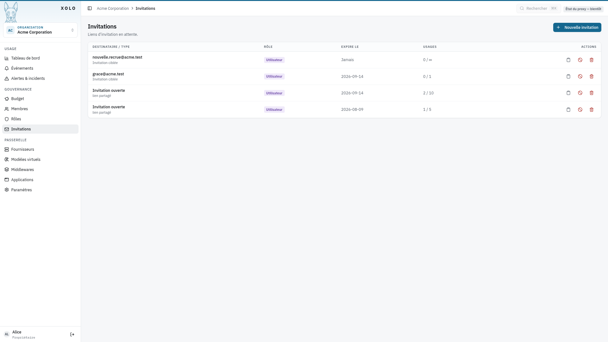
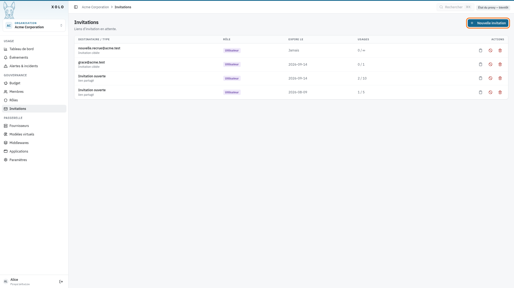
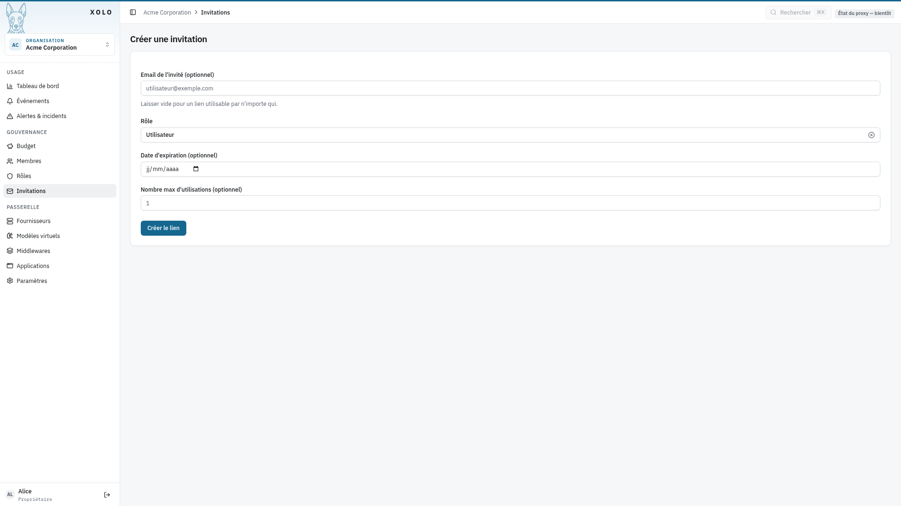
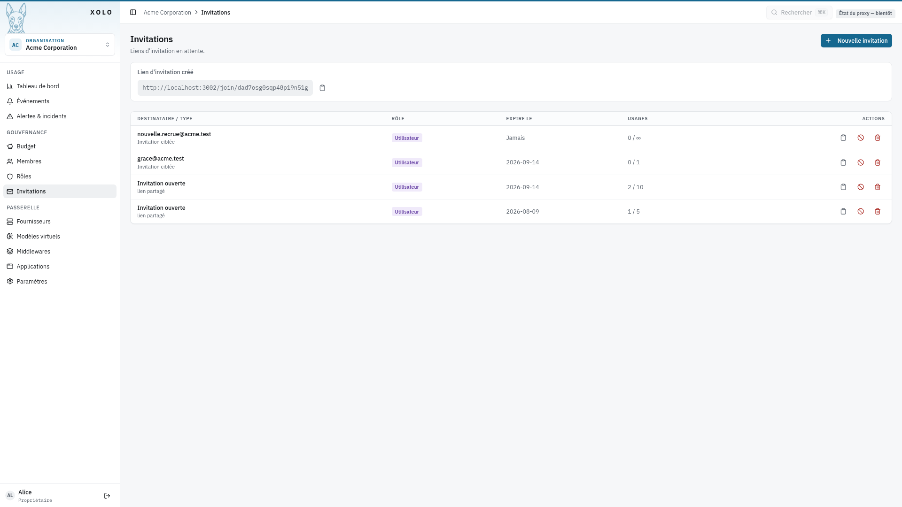
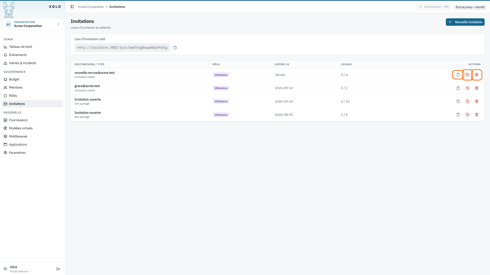

# Invitation des utilisateurs

## Qu'est-ce qu'une invitation ?

Une invitation est un lien qui permet à un utilisateur de rejoindre votre organisation. Le lien peut être :

- **Ciblé** : lié à une adresse email spécifique
- **Ouvert** : utilisable par n'importe qui

## Accéder aux invitations

1. Allez dans votre organisation : `/orgs/{slug}/`
2. Cliquez sur **Invitations** dans le menu admin

> **Note** : Vous devez disposer de la permission `invites:write` pour créer ou gérer des invitations.

## Créer une invitation

1. Cliquez sur **Nouvelle invitation** (bouton en haut à droite)
   

2. Remplissez les informations :
   

### Champs du formulaire

| Champ | Description |
|-------|-------------|
| **Email de l'invité** | Email du destinataire (optionnel — laisser vide pour un lien ouvert) |
| **Rôle** | Rôle attribué à l'utilisateur à son arrivée (Membre, Admin, etc.) |
| **Date d'expiration** | Date limite d'utilisation du lien (optionnel) |
| **Nombre max d'utilisations** | Limite d'utilisations du lien (optionnel) |

3. Cliquez sur **Créer le lien**.

4. Le lien d'invitation s'affiche — copiez-le et envoyez-le à l'utilisateur.
   

## Types d'invitations

### Invitation ciblée

Liez le convite à une adresse email. Seule la personne avec cet email pourra l'utiliser. La comparaison ignore la casse : peu importe que vous saisissiez `Jean.Dupont@corp.tld` là où le fournisseur d'identité renvoie `jean.dupont@corp.tld`.

Le destinataire n'a pas besoin de posséder déjà un compte Xolo : une invitation ciblée en attente vaut pré-provisionnement, et le compte se crée à sa première connexion même lorsque `XOLO_HTTP_AUTHN_AUTO_CREATE_USERS` vaut `false`. Une invitation **ouverte** n'accorde pas cette dispense — elle ne nomme personne.

L'activation du compte, elle, reste réglée par `XOLO_HTTP_AUTHN_ACTIVE_BY_DEFAULT`. Un destinataire dont le compte est encore inactif accepte malgré tout son invitation — il obtient son adhésion et son rôle immédiatement — mais le reste de l'instance lui répond « compte désactivé » jusqu'à ce qu'un administrateur l'active depuis `/admin/users`.

### Invitation ouverte

Laissez le champ email vide. Le lien pourra être utilisé par n'importe qui — utile pour partager l'accès publiquement.

## Gérer les invitations

Pour chaque invitation, plusieurs actions sont disponibles :

| Action | Description |
|--------|-------------|
| **Copier le lien** | Copie l'URL d'invitation dans le presse-papiers |
| **Révoquer** | Invalide le lien immédiatement (l'utilisateur ne peut plus l'utiliser) |
| **Supprimer** | Supprime définitivement l'invitation de la liste |

### États d'une invitation

| État | Signification |
|------|---------------|
| Active | Le lien fonctionne normalement |
| Révoqué | Le lien a été invalidé manuellement |
| Expirée | La date d'expiration est dépassée |
| Épuisée | Le nombre max d'utilisations est atteint |

## Permissions

| Action | Permission requise |
|--------|-------------------|
| Consulter les invitations | `invites:read` |
| Créer, révoquer, supprimer | `invites:write` |