# Modèle virtuel

## Qu'est-ce qu'un modèle virtuel ?

Un modèle virtuel est un modèle personnalisé qui applique des traitements automatiques aux requêtes. Par exemple, il peut anonymiser les prompts, ajouter un prompt système, etc.

Une fois créé, il fonctionne comme un modèle classique. L'utilisateur ne perçoit pas les traitements appliqués en arrière-plan par les plugins.

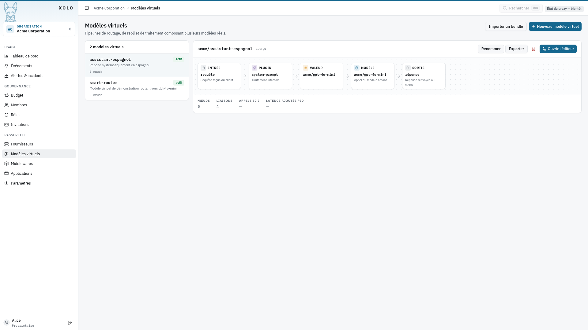

## Création d'un modèle virtuel

Pour créer un modèle virtuel :

1. Cliquez sur `Nouveau modèle virtuel`
   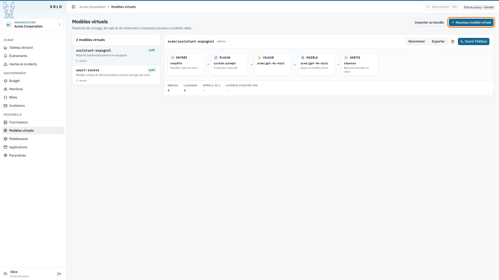
2. Renseignez les informations demandées
3. Cliquez sur `Enregistrer`
   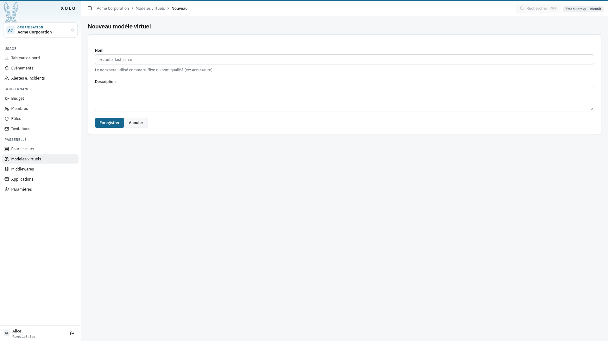
4. Votre modèle est créé et prêt à être configuré
   

## Présentation de l'éditeur de pipeline

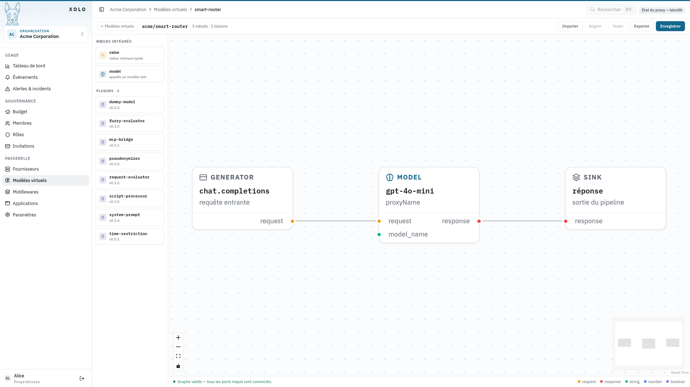

Cet éditeur permet de configurer des traitements qui seront appliqués automatiquement aux requêtes et aux réponses du modèle.

La palette de gauche liste d'abord les nœuds intégrés, puis les plugins chargés sur cette installation. Le panneau de droite configure le nœud sélectionné. Chaque nœud, ses ports et sa configuration sont décrits dans [Nœuds de pipeline](../../../concepts/noeuds-pipeline.md) ; le fonctionnement général du pipeline dans [Fournisseurs, modèles et pipelines](../../../concepts/fournisseurs-modeles-pipeline.md).

## Exemple : configuration du plugin `system-prompt`

Voici comment configurer le plugin `system-prompt` pour ajouter un prompt système personnalisé :

1. Dans la palette de gauche, cliquez sur le plugin `system-prompt` pour l'ajouter au graphe
   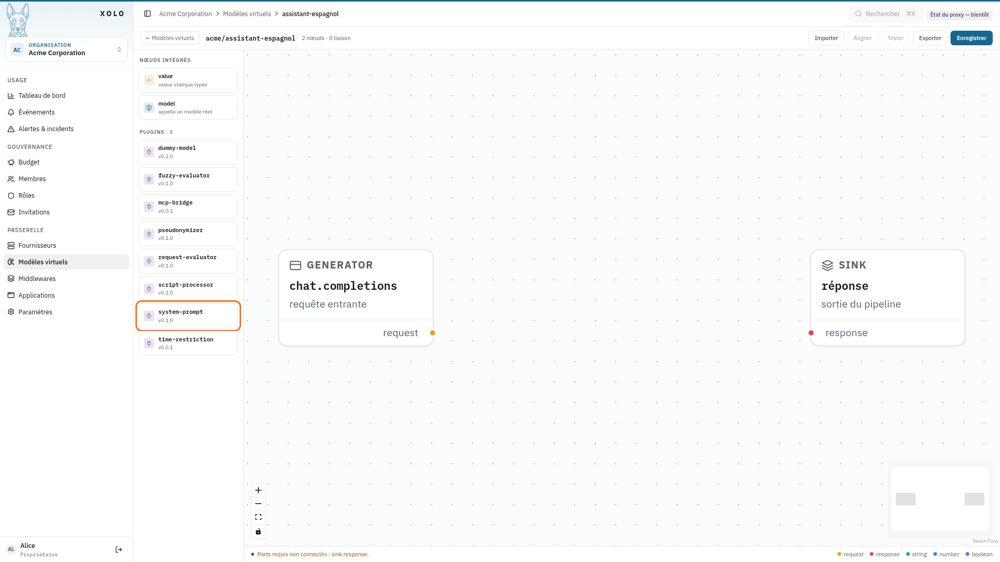
2. Reliez les ports des nœuds en faisant glisser un port de sortie vers un port d'entrée
   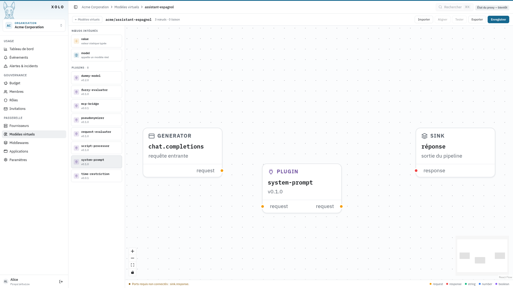
3. Sélectionnez le nœud du plugin : son panneau de configuration s'ouvre à droite de l'éditeur
   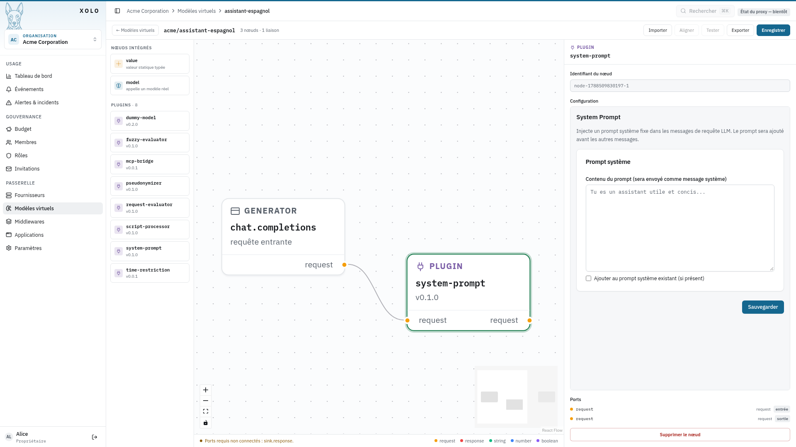
4. Saisissez votre prompt système. La case **Ajouter au prompt système existant** détermine si le
   prompt complète celui de la requête ou le remplace entièrement
   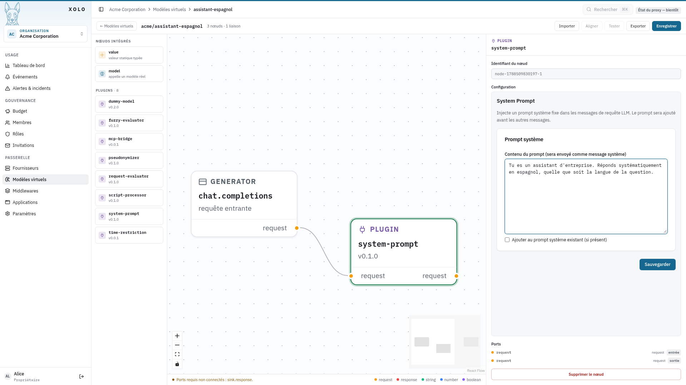
5. Cliquez sur `Sauvegarder` pour valider la configuration du nœud
6. Ajoutez un nœud `model` depuis la palette, reliez-le, puis sélectionnez-le : renseignez le
   **Modèle appelé** dans son panneau de configuration
   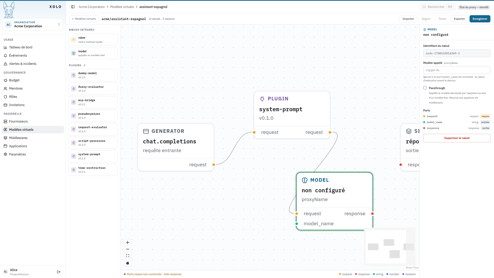
7. Pour rendre ce nom dynamique, ajoutez un nœud `model_ref` depuis la palette. Un nœud `value` de
   type `string` fonctionne aussi, mais il faut alors taper le nom sans se tromper
   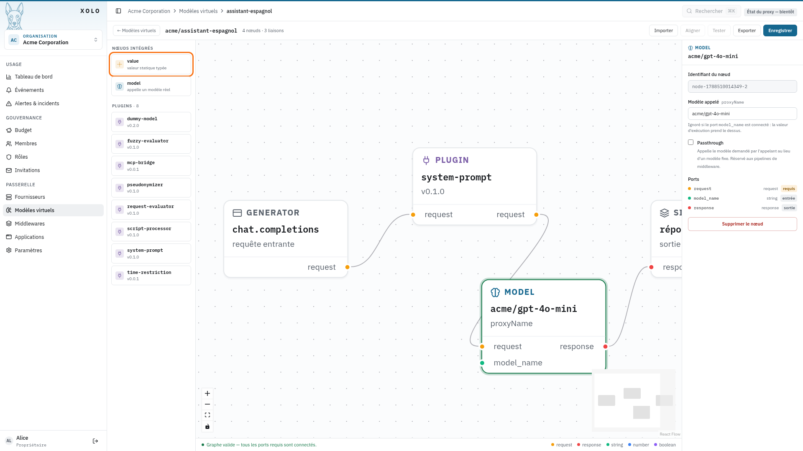
8. Choisissez le modèle sous-jacent dans la liste, puis reliez la sortie `model_name` du nœud au
   port `model_name` du nœud `model`
   
9. Le bandeau bas indique **Graphe valide** lorsque tous les ports requis sont connectés. Cliquez
   sur `Enregistrer` pour publier le pipeline
   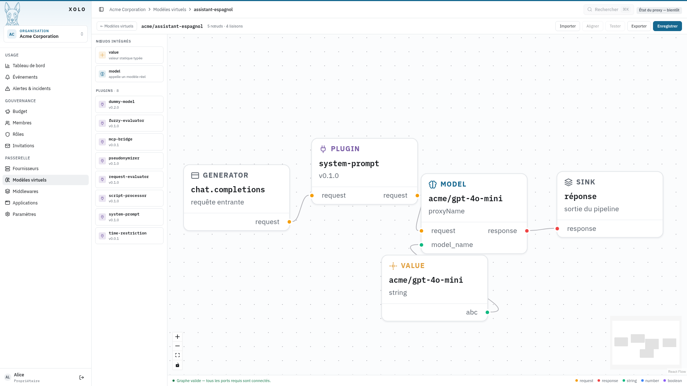

### Résultat

Dans cet exemple, `acme/assistant-espagnol` s'appuie sur le modèle `acme/gpt-4o-mini` et répond uniquement en espagnol, grâce au plugin `system-prompt` configuré.

Le modèle virtuel est exposé aux utilisateurs sous la forme : `nom-de-l'organisation/nom_du_modele`. Dans notre exemple : `acme/assistant-espagnol`

Pour l'utilisateur final, ce modèle fonctionne comme n'importe quel autre modèle. Toute la personnalisation reste transparente, gérée en arrière-plan.
