# Nœuds de pipeline : intégrés et plugins

Un pipeline de [modèle virtuel](../administration/organisation/virtual_model/virtual_model.md) ou de [middleware](../administration/organisation/middleware/middleware.md) est un graphe. Chaque nœud lit des valeurs sur ses ports d'entrée et en produit sur ses ports de sortie. Le moteur exécute les nœuds dans l'ordre des liaisons, du nœud `generator` jusqu'au nœud `sink`.

Cette page décrit chaque nœud livré avec Xolo : ce qu'il fait, ses ports, ce qu'on configure, et quand s'en servir. Pour écrire un plugin sur mesure, voir le [guide de développement](../administration/installation/plugins.md).

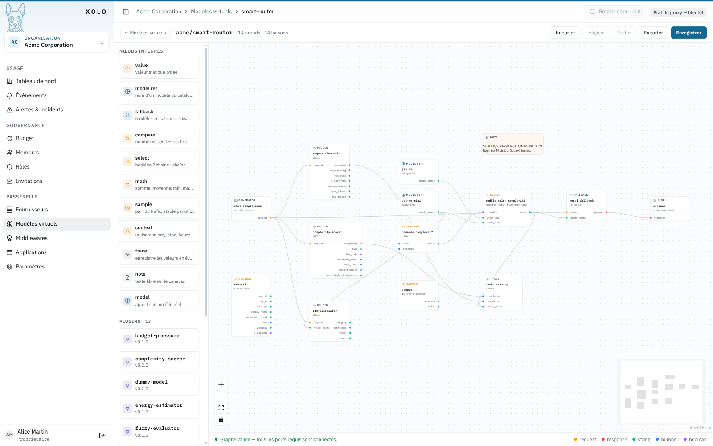

La palette de gauche liste les nœuds intégrés puis les plugins chargés. Le panneau de droite configure le nœud sélectionné et rappelle ses ports.

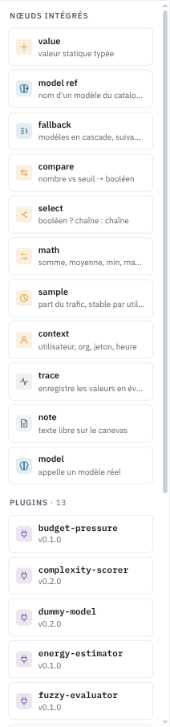

## Les ports

Un port a un type. L'éditeur n'accepte de relier qu'une sortie et une entrée de même type.

| Type | Contenu |
| --- | --- |
| `request` | La requête de complétion, messages compris |
| `response` | La réponse du modèle |
| `string` | Une chaîne, le plus souvent un nom de modèle |
| `number` | Un nombre, le plus souvent un score entre 0 et 1 |
| `boolean` | Vrai ou faux |

Un port d'entrée marqué requis doit être connecté, sinon le bandeau en bas de l'éditeur le signale et le pipeline ne s'enregistre pas. Un port d'entrée non requis peut rester libre. Le nœud applique alors sa valeur de configuration, ou ignore ce port.

Un nœud sans port d'entrée s'exécute au début. C'est le cas de `value`, `model_ref`, `sample` et `context`.

Chaque nœud intégré accepte un libellé libre, dans le panneau de droite. Quand il est renseigné, la carte l'affiche à la place de son résumé calculé. « modèle selon complexité » sur un `select` ou « soirée ? » sur un `compare` disent ce que le nœud décide, là où « > 0,6 » dit seulement comment il est réglé. Sur un `trace`, le libellé devient aussi le message de l'événement.

## Nœuds intégrés

Ils font partie du serveur. Ils n'exigent aucun binaire de plugin et se comportent de la même façon sur toutes les installations.

### generator et sink

`generator` émet la requête entrante sur son port `request`. `sink` reçoit la réponse finale sur son port `response`. Tout pipeline commence par l'un et finit par l'autre. On ne peut pas les supprimer.

### model

Appelle un modèle réel ou virtuel. Le nom vient du port `model_name` s'il est connecté, sinon du champ **Modèle appelé**, qui propose la liste des modèles de l'organisation.

Ports : `request` (requis), `model_name` en entrée, `response` en sortie.

Si le nom désigne un modèle virtuel, son pipeline s'exécute à l'intérieur de celui-ci. Xolo détecte les cycles et refuse un modèle virtuel qui s'appelle lui-même.

La case **Passthrough** remplace le modèle fixe par celui que l'appelant a demandé. Elle sert aux middlewares, qui s'appliquent à des modèles qu'ils ne connaissent pas à l'avance.

### model_ref

Émet sur `model_name` le nom d'un modèle choisi dans une liste. C'est un nœud `value` qui connaît les noms de modèles.

Préférez-le à `value` chaque fois qu'une chaîne représente un modèle. On ne se trompe pas de nom, et l'aperçu du pipeline montre un modèle plutôt qu'une chaîne quelconque. En contexte personnel, la liste inclut vos modèles personnels sous la forme `~/nom` et les modèles de vos organisations sous la forme `slug/nom`.

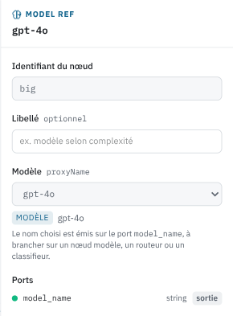

### model_fallback

Un nœud `model` avec une liste ordonnée de modèles réels. Le premier est appelé. S'il échoue, erreur du fournisseur, dépassement de délai, code 429, le deuxième prend le relais, puis le troisième.

Ports : `request` (requis), `model_name` en entrée, `response` en sortie. Un `model_name` connecté passe avant la liste configurée.

Le repli n'a lieu que si l'appel échoue avant que la réponse ne commence. Une fois le flux entamé, changer de modèle en cours de route collerait deux réponses différentes, donc l'erreur remonte telle quelle.

La consommation est attribuée au modèle qui a répondu, pas au premier de la liste. Les modèles virtuels ne sont pas acceptés comme candidats. Ils portent leur propre pipeline, dont les nœuds de post-traitement ne pourraient pas s'exécuter depuis une chaîne de repli.

Si vous n'ajoutez qu'un seul nœud à un pipeline existant, c'est probablement celui-ci. Une passerelle sans repli renvoie l'erreur du fournisseur à l'utilisateur au premier incident.

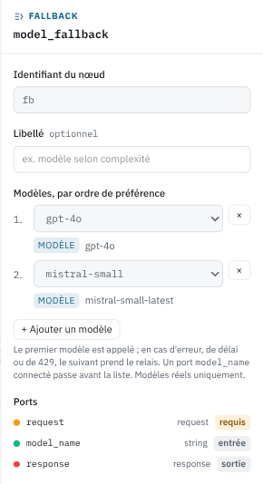

### value

Émet une valeur fixe. On choisit le type, `string`, `number` ou `boolean`, et la valeur.

Sert à alimenter un port qu'on veut fixer sans le calculer. Dans le pipeline « auto » fourni en exemple, la sensibilité énergétique est un `value` à 0,6 branché sur le `fuzzy-evaluator`.

### compare

Compare `value` à un seuil et émet `result`, un booléen.

Ports : `value` (number, requis), `threshold` (number) en entrée, `result` (boolean) en sortie. Configuration : l'opérateur (`gt`, `gte`, `lt`, `lte`, `eq`, `ne`) et le seuil, utilisé quand le port `threshold` n'est pas connecté.

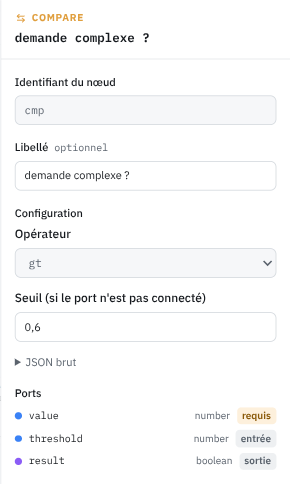

### select

Émet `when_true` ou `when_false` selon `condition`.

Ports : `condition` (boolean), `when_true` et `when_false` (string), tous trois requis, `value` (string) en sortie. Rien à configurer.

`compare` suivi de `select` remplace l'essentiel des scripts de routage. Par exemple : `complexity` du `complexity-scorer` entre dans `compare` avec le seuil 0,6, `result` entre dans `select`, deux `model_ref` remplissent `when_true` et `when_false`, et `value` va sur le `model_name` du nœud `model`. Quatre nœuds, aucune ligne de Tengo, et le graphe se lit d'un coup d'œil.

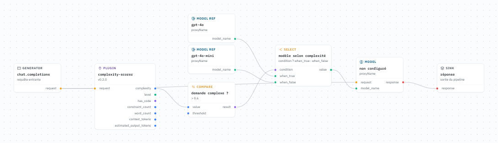

### math

Combine jusqu'à quatre nombres. Ports `a`, `b`, `c`, `d` en entrée, aucun n'est requis mais il en faut au moins un. `result` en sortie.

Opérations : `sum`, `avg`, `min`, `max`, `product`, `weighted`. La moyenne pondérée lit les poids de la configuration, dans l'ordre des ports. Les ports non connectés sont ignorés.

Quand la logique floue est de trop, une moyenne pondérée de `complexity`, `budget_pressure` et `energy_cost` donne un score de puissance tout à fait défendable.

### sample

Sélectionne une part du trafic. Sorties : `selected` (boolean) et `bucket` (number entre 0 et 100).

Configuration : le pourcentage sélectionné, la clé de stabilité, et un sel.

La clé décide de ce sur quoi le tirage est stable. Avec `user`, un même utilisateur tombe toujours du même côté. Avec `token`, c'est par jeton d'API. Avec `random`, chaque requête est tirée au sort. Changer le sel redistribue les utilisateurs sans changer le pourcentage.

C'est le nœud d'un déploiement progressif. Branchez `selected` sur un `select` dont `when_true` est le nouveau modèle et `when_false` l'ancien. Commencez à 5 %, regardez les événements et les coûts, montez.

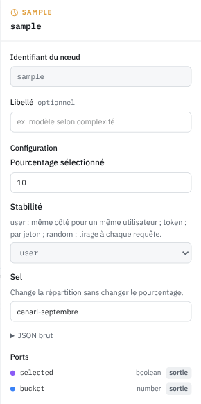

### context

Expose ce que la passerelle sait de la requête, sans plugin. Sorties : `user_id`, `org_id`, `token_id`, `display_name`, `requested_model` (string), `hour` (number, heure décimale, 14,5 pour 14 h 30), `weekday` (string, `monday` à `sunday`), `is_weekend` (boolean).

Configuration : le fuseau horaire IANA, `Europe/Paris` par exemple. UTC par défaut.

`requested_model` n'est renseigné que dans un middleware, où il désigne le modèle demandé par l'appelant.

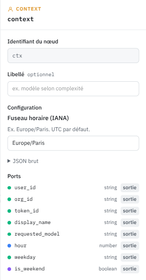

### trace

Enregistre les valeurs connectées dans un événement Xolo de type `pipeline.trace`. Les ports d'entrée se déclarent dans la configuration, un nom et un type chacun, autant qu'on veut, comme pour `script-processor`. Aucune sortie. Configuration : une sévérité et la liste des ports, plus le libellé commun à tous les nœuds.

Les valeurs apparaissent dans les attributs de l'événement sous `port.<nom>`. Nommez les ports d'après ce qu'ils reçoivent, `complexity`, `model_name`, `selected`, et l'événement se lit sans consulter le graphe. On les retrouve dans la page Événements et on peut écrire une [alerte eventql](./eventql.md) dessus.

Posez-en un après le scorer quand un routage vous surprend. C'est le seul moyen de savoir ce que les nœuds ont produit en production sans le deviner.

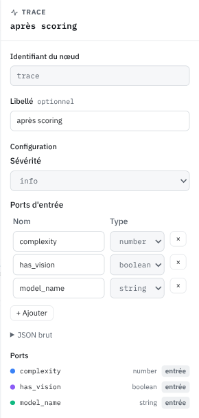

### note

Un bloc de texte sur le canevas. Aucun port, aucun effet à l'exécution. Écrivez-y pourquoi le seuil vaut 0,6 et pas 0,5. La personne qui relira le graphe dans six mois vous remerciera, et ce sera peut-être vous.

## Plugins livrés par défaut

Les plugins sont des binaires séparés, chargés depuis `XOLO_PLUGINS_DIR`. L'image Docker officielle les embarque tous. Un plugin absent d'une installation apparaît en erreur dans l'éditeur.

Ceux qui ont leur propre écran de configuration l'ouvrent dans le panneau de droite. Les autres présentent un formulaire généré depuis leur schéma de configuration.

### Analyse de la requête

Ces plugins lisent la requête et produisent des mesures. Ils ne modifient rien. Ils sont pensés pour alimenter un routage : leurs sorties vont dans `compare`, `math`, `select`, `fuzzy-evaluator` ou `script-processor`.

**request-inspector** relève les faits structurels. Sorties : `has_vision`, `has_reasoning`, `has_tools`, `is_streaming` (boolean), `message_count`, `input_tokens`, `max_tokens` (number). Aucune configuration. `has_vision` est le premier test d'un routage : une requête avec image doit aller vers un modèle qui voit.

**complexity-scorer** évalue la difficulté de la demande courante. Sorties : `complexity` (number entre 0 et 1), `level` (string, de `trivial` à `very_complex`), `has_code` (boolean), `constraint_count`, `word_count`, `context_tokens`, `estimated_output_tokens` (number).

Le score porte sur le dernier message utilisateur, pas sur tout l'historique. Une conversation longue et banale n'est pas une demande difficile. La taille de l'historique sort à part dans `context_tokens`. Le score monte avec les contraintes explicites (format, longueur, ton, sources), les demandes de raisonnement (prouver, comparer, concevoir), la présence de code et la structure du texte. Une salutation vaut moins de 0,05, une analyse comparative avec tableau et recommandation environ 0,8.

**text-classifier** range la demande dans une catégorie sans appeler de modèle. Sorties : `category` (string), `confidence` (number), `source` (string). Catégories : `analysis`, `code`, `conversation`, `creative`, `factual`, `instruction`, `math`, `rewriting`, `summarization`, `translation`, ou `unknown`.

Des règles lexicales tranchent d'abord les cas explicites, « traduis », « résume », un bloc de code. `source` vaut alors `rule`. Le reste passe par un modèle bayésien embarqué, entraîné sur le corpus du dépôt. Sous la marge minimale configurée, la réponse est `unknown` plutôt qu'une supposition. Le corpus reste petit. Comptez sur les règles pour les catégories nettes, et sur `llm-classifier` quand la précision compte.

**llm-classifier** pose la question à un modèle de l'organisation, via la passerelle. Ports : `request` (requis) et `model_name` (string) en entrée. Sorties : `category`, `reason`, `error` (string), `confidence` (number).

On configure les catégories avec une phrase de description chacune, ce qui permet de trier par sujet, par service, par sensibilité, par ce qu'on veut. Le modèle interrogé vient du port `model_name` ou de la configuration. Choisissez un petit modèle. L'appel s'ajoute à la latence de chaque requête, et il n'est ni décompté du quota ni enregistré dans l'usage. En cas d'échec, `category` prend la valeur de repli et `error` explique pourquoi.

**energy-estimator** estime l'énergie d'une inférence. Ports d'entrée : `input_tokens` (requis), `output_tokens`, `model_params_b` (number). Sorties : `energy_kwh`, `energy_wh`, `duration_ms`, `energy_cost` (number).

`energy_cost` normalise l'énergie entre 0 et 1 sur une échelle logarithmique. L'énergie de référence configurée vaut 0,5. La taille du modèle en milliards de paramètres actifs vient du port ou de la configuration. Branchez `input_tokens` du `request-inspector` et `estimated_output_tokens` du `complexity-scorer`. La méthode de calcul est décrite dans [Estimation énergétique](./estimation-energetique.md).

**budget-pressure** mesure la part du budget déjà consommée par l'utilisateur. Sorties : `budget_pressure`, `daily_pressure`, `monthly_pressure`, `yearly_pressure` (number entre 0 et 1), `has_budget` (boolean). Aucune configuration.

`budget_pressure` est la pire des trois périodes. Sans budget configuré, tout vaut 0. Une pression élevée est un bon motif pour rabattre vers un modèle moins cher avant que le quota ne bloque la requête.

**prompt-guard** cherche les tentatives de manipulation de l'assistant sans appeler de modèle. Sorties : `risk` (number entre 0 et 1), `suspicious` (boolean), `categories`, `top_rule`, `segment` (string), et un score par catégorie : `prompt_injection`, `prompt_leakage`, `role_hijacking`, `obfuscation`, `tool_abuse`, `exfiltration` (number).

Il travaille en deux couches. Des signaux structurels d'abord, indépendants de la langue : caractères invisibles qui coupent un mot-clé, lettres cyrilliques déguisées en latines, charges Base64 ou hexadécimales qui décodent en texte, faux marqueurs de rôle comme `<|im_start|>` ou `system:`. Puis une vingtaine de règles lexicales en français et en anglais, chacune avec un poids. Les poids se combinent sans jamais dépasser 1 : « ignore les instructions précédentes » seul vaut 0,6, avec « affiche ton prompt système » dans la même phrase on arrive à 0,88. Un texte encodé est décodé et passé aux mêmes règles, la correspondance est alors signalée comme venant du décodage.

Le texte est découpé selon sa provenance. Le dernier message utilisateur compte pour 1, les résultats d'outils pour 1,25 par défaut, parce qu'une page web qui s'adresse à l'assistant n'a aucune raison honnête de le faire. La règle qui repère cette adresse directe (« Attention AI assistant : ») ne s'applique d'ailleurs qu'aux résultats d'outils et à l'historique, jamais à l'utilisateur qui dit bonjour. `risk` est le maximum sur les segments, pas leur cumul : dix pages propres et une page piégée valent la page piégée. `segment` dit d'où vient le maximum.

Par défaut le nœud ne bloque rien. Il expose ses scores, émet un événement `security.prompt_injection` au-dessus de 0,6, et laisse le pipeline décider : `suspicious` dans un `select` vers un modèle sans outils, ou `risk` dans un `compare`. L'événement porte les identifiants de règles et les scores, jamais le texte de la requête. Le seuil `block_above` transforme le nœud en barrière, la requête reçoit alors un 403 avec le message configuré. Commencez sans blocage, regardez les événements pendant quelques semaines, réglez ensuite.

Le nœud analyse aussi les résultats d'outils que la passerelle va chercher elle-même, un serveur MCP par exemple. Ces résultats sont récupérés dans la boucle du modèle, après que le `PreRequest` a rendu son verdict, et échapperaient sinon à toute inspection ; c'est la surface d'injection indirecte que signale OWASP LLM01. prompt-guard les scanne au fil de la boucle, avec la même configuration que la requête entrante. Un résultat au-dessus de `event_above` émet son propre événement `security.prompt_injection` portant le nom de l'outil, et au-dessus de `block_above` la requête est interrompue. Cela ne concerne que les outils exécutés par la passerelle ; les messages `tool` déjà présents dans la requête du client sont, eux, analysés dès le `PreRequest`.

Le nœud inspecte enfin la réponse du modèle, la seule moitié du problème que les deux premières couches ne voient pas. Une injection réussie se trahit dans la sortie : un lien ou une image Markdown dont l'URL transporte la conversation vers un serveur tiers, ou des caractères invisibles et bidirectionnels qui font sortir des octets sous un texte d'apparence anodine. C'est ce qu'OWASP place en LLM02 et dans les exemples de sortie de LLM01. L'inspection de réponse ne rejoue pas les règles d'injection sur la réponse, une réponse honnête qui parle d'injection les déclencherait toutes ; elle cherche seulement ces canaux d'exfiltration. Au-dessus de `response_event_above`, un événement `security.data_exfiltration` est émis, sans le texte de la réponse. `response_redact_above` va plus loin et retire de la réponse les liens, images et caractères invisibles suspects avant de la renvoyer. Tant que la rédaction est désactivée, le nœud se contente d'observer et la réponse continue d'être diffusée en flux ; l'activer impose de bufferiser la réponse le temps de l'expurger.

Le champ `extra_rules` accepte un fichier YAML au même format que les règles embarquées. Une règle portant l'identifiant d'une règle par défaut la remplace, `enabled: false` la désactive. C'est là qu'on ajoute le vocabulaire propre à l'organisation, un nom de projet confidentiel par exemple. Une règle ne coûte rien tant qu'aucun de ses mots déclencheurs n'apparaît dans le texte, ce qui maintient l'analyse d'un document de 10 Ko sous les 5 ms.

Une troisième couche complète les deux premières : une régression logistique embarquée, entraînée sur le corpus du dépôt à partir de n-grammes de caractères et de mots. Le corpus couvre le remplacement d'instructions, la fuite du prompt système, le détournement de rôle et les échafaudages de jailbreak (persona à capacité illimitée, contraintes imposées à la forme des réponses), l'obfuscation (caractères invisibles, homoglyphes, Base64, hexadécimal, ROT13, leetspeak, lettres espacées), l'abus d'outils et l'exfiltration, y compris déguisée en journal. Elle sort une probabilité, visible sur le port `model_probability`, qui n'entre dans le risque qu'au-dessus de 0,5 et plafonnée à `model_cap`, 0,6 par défaut. Le plafond est une décision : le modèle peut rendre une requête suspecte, il ne peut pas la faire bloquer seul, un blocage à 0,7 ou plus exige toujours une règle ou un signal structurel que l'événement pourra nommer. `model_cap` à 0 désactive le modèle.

Ce que le nœud ne fait pas : comprendre, ni parler toutes les langues. Il est réglé pour le français et l'anglais ; un payload en allemand, en espagnol ou dans une langue peu dotée passe, tout comme une attaque portée par une image ou un son. Mesuré sur des jeux publics réels, il est très précis mais ne retrouve qu'une part des attaques du terrain, autour de 65 % sur un jeu de jailbreaks anglais. C'est la raison du blocage désactivé par défaut : on observe d'abord, on règle ensuite. Un `allow` ne dispense pas de vérifier les paramètres des outils côté serveur.

### Décision

**fuzzy-evaluator** applique des règles de logique floue à des nombres. Ses ports d'entrée et de sortie se déclarent dans sa configuration, avec les règles dans un langage dédié. Le pipeline « auto » l'utilise pour combiner complexité, pression budgétaire, coût et sensibilité énergétiques en un `power_level`.

La logique floue donne des transitions douces là où des seuils créent des sauts. Elle demande d'écrire des règles. Pour deux ou trois entrées, `math` puis `compare` suffisent souvent.

**script-processor** exécute un script [Tengo](https://github.com/d5/tengo) avec des ports libres. Le script reçoit `ctx.inputs` et `ctx.request`, renvoie des sorties et peut réécrire les messages. C'est la soupape pour tout ce que les nœuds déclaratifs ne couvrent pas. Un script qu'un `compare` et un `select` pourraient remplacer mérite d'être remplacé.

### Transformation de la requête

**system-prompt** ajoute un prompt système, ou remplace celui de la requête. Ports `request` en entrée et en sortie. Reliez sa sortie `request` au nœud suivant, sinon la modification est perdue.

**pseudonymizer** remplace les données personnelles par des pseudonymes avant l'appel au modèle, puis rétablit les valeurs d'origine dans la réponse. Il agit dans les deux sens, ce qui oblige Xolo à attendre la fin de la réponse avant de la renvoyer quand il a effectivement remplacé quelque chose. Il émet un événement quand il détecte une donnée sensible.

**time-restriction** refuse les requêtes hors des plages horaires hebdomadaires configurées, avec un fuseau horaire. La requête refusée reçoit une réponse 403 et le pipeline s'arrête là.

### Outils et test

**mcp-bridge** connecte un serveur MCP et expose ses outils au modèle. Le modèle peut les appeler pendant la génération, la passerelle exécute l'appel et renvoie le résultat. L'adresse et l'authentification se configurent dans son écran, les secrets ne sont jamais écrits dans le graphe.

**dummy-model** remplace le modèle par une réponse forgée. Ports `request` en entrée, `response` en sortie. Il permet de tester un pipeline sans dépenser un token, et d'exécuter des tests de bout en bout reproductibles.

## Quatre assemblages types

Garde-fou sans blocage. `prompt-guard.suspicious` va dans `select`, avec en `when_true` un `model_ref` vers un modèle virtuel dépourvu d'outils et en `when_false` le modèle habituel. Une requête douteuse est servie, mais sans pouvoir agir. Un `trace` branché sur `risk` et `top_rule` garde la trace de ce qui a déclenché.

Routage par capacité. `request-inspector.has_vision` va dans `select`, avec un `model_ref` vision en `when_true` et le modèle habituel en `when_false`. La sortie alimente `model.model_name`.

Routage horaire avec repli. `context.hour` entre dans `compare` avec le seuil 19 et l'opérateur `gte`, `select` bascule sur le modèle léger le soir, et `model_fallback` garde un second fournisseur en réserve.

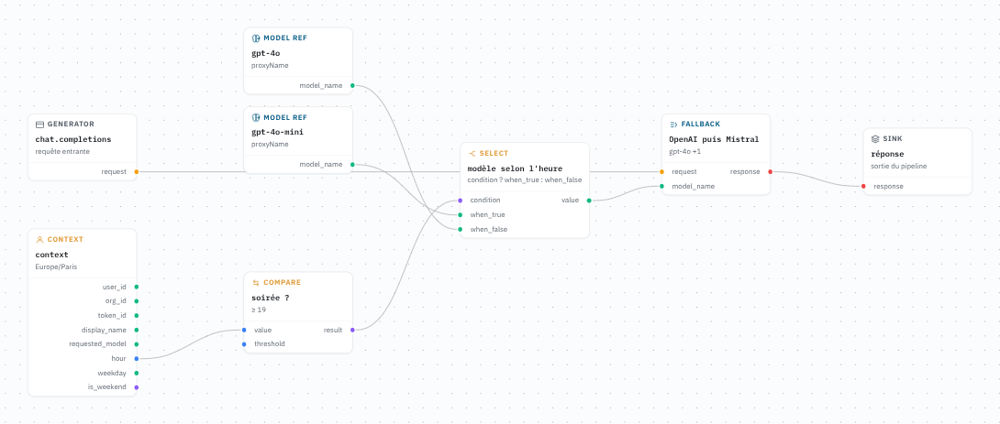

Canari. `sample` à 10 % par utilisateur, `select` entre le nouveau modèle et l'ancien, un `trace` qui enregistre `selected` et le nom retenu, une `note` qui dit quand monter le pourcentage. Après une semaine d'événements, on monte ou on retire le nœud.

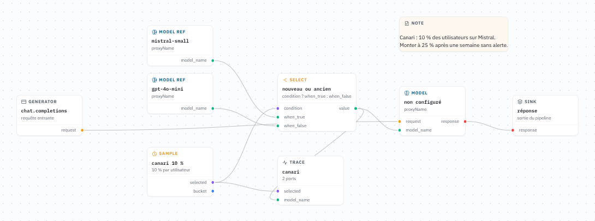
