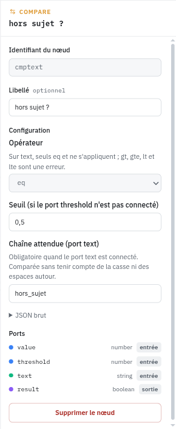

# Nœuds intégrés

> Retour à la [vue d'ensemble des nœuds](../index.md).

Ils font partie du serveur. Ils n'exigent aucun binaire de plugin et se comportent de la même façon sur toutes les installations.

## generator et sink

`generator` émet la requête entrante sur son port `request`. `sink` reçoit la réponse finale sur son port `response`. Tout pipeline commence par l'un et finit par l'autre. On ne peut pas les supprimer.

## model

Appelle un modèle réel ou virtuel. Le nom vient du port `model_name` s'il est connecté, sinon du champ **Modèle appelé**, qui propose la liste des modèles de l'organisation.

Ports : `request` (requis), `model_name` en entrée, `response` en sortie.

Si le nom désigne un modèle virtuel, son pipeline s'exécute à l'intérieur de celui-ci. Xolo détecte les cycles et refuse un modèle virtuel qui s'appelle lui-même.

La case **Passthrough** remplace le modèle fixe par celui que l'appelant a demandé. Elle sert aux middlewares, qui s'appliquent à des modèles qu'ils ne connaissent pas à l'avance.

## model_ref

Émet sur `model_name` le nom d'un modèle choisi dans une liste. C'est un nœud `value` qui connaît les noms de modèles.

Préférez-le à `value` chaque fois qu'une chaîne représente un modèle. On ne se trompe pas de nom, et l'aperçu du pipeline montre un modèle plutôt qu'une chaîne quelconque. En contexte personnel, la liste inclut vos modèles personnels sous la forme `~/nom` et les modèles de vos organisations sous la forme `slug/nom`.

## model_fallback

Un nœud `model` avec une liste ordonnée de modèles réels. Le premier est appelé. S'il échoue, erreur du fournisseur, dépassement de délai, code 429, le deuxième prend le relais, puis le troisième.

Ports : `request` (requis), `model_name` en entrée, `response` en sortie. Un `model_name` connecté passe avant la liste configurée.

Le repli n'a lieu que si l'appel échoue avant que la réponse ne commence. Une fois le flux entamé, changer de modèle en cours de route collerait deux réponses différentes, donc l'erreur remonte telle quelle.

La consommation est attribuée au modèle qui a répondu, pas au premier de la liste. Les modèles virtuels ne sont pas acceptés comme candidats. Ils portent leur propre pipeline, dont les nœuds de post-traitement ne pourraient pas s'exécuter depuis une chaîne de repli.

Si vous n'ajoutez qu'un seul nœud à un pipeline existant, c'est probablement celui-ci. Une passerelle sans repli renvoie l'erreur du fournisseur à l'utilisateur au premier incident.

## value

Émet une valeur fixe. On choisit le type, `string`, `number` ou `boolean`, et la valeur.

Sert à alimenter un port qu'on veut fixer sans le calculer. Dans le pipeline « auto » fourni en exemple, la sensibilité énergétique est un `value` à 0,6 branché sur le `fuzzy-evaluator`.

## compare

Compare `value` à un seuil et émet `result`, un booléen.

Ports : `value` (number, requis), `threshold` (number) en entrée, `result` (boolean) en sortie. Configuration : l'opérateur (`gt`, `gte`, `lt`, `lte`, `eq`, `ne`) et le seuil, utilisé quand le port `threshold` n'est pas connecté.

## select

Émet `when_true` ou `when_false` selon `condition`.

Ports : `condition` (boolean), `when_true` et `when_false` (string), tous trois requis, `value` (string) en sortie. Rien à configurer.

`compare` suivi de `select` remplace l'essentiel des scripts de routage. Par exemple : `complexity` du `complexity-scorer` entre dans `compare` avec le seuil 0,6, `result` entre dans `select`, deux `model_ref` remplissent `when_true` et `when_false`, et `value` va sur le `model_name` du nœud `model`. Quatre nœuds, aucune ligne de Tengo, et le graphe se lit d'un coup d'œil.

## math

Combine jusqu'à quatre nombres. Ports `a`, `b`, `c`, `d` en entrée, aucun n'est requis mais il en faut au moins un. `result` en sortie.

Opérations : `sum`, `avg`, `min`, `max`, `product`, `weighted`. La moyenne pondérée lit les poids de la configuration, dans l'ordre des ports. Les ports non connectés sont ignorés.

Quand la logique floue est de trop, une moyenne pondérée de `complexity`, `budget_pressure` et `energy_cost` donne un score de puissance tout à fait défendable.

## sample

Sélectionne une part du trafic. Sorties : `selected` (boolean) et `bucket` (number entre 0 et 100).

Configuration : le pourcentage sélectionné, la clé de stabilité, et un sel.

La clé décide de ce sur quoi le tirage est stable. Avec `user`, un même utilisateur tombe toujours du même côté. Avec `token`, c'est par jeton d'API. Avec `random`, chaque requête est tirée au sort. Changer le sel redistribue les utilisateurs sans changer le pourcentage.

C'est le nœud d'un déploiement progressif. Branchez `selected` sur un `select` dont `when_true` est le nouveau modèle et `when_false` l'ancien. Commencez à 5 %, regardez les événements et les coûts, montez.

## context

Expose ce que la passerelle sait de la requête, sans plugin. Sorties : `user_id`, `org_id`, `token_id`, `display_name`, `requested_model` (string), `hour` (number, heure décimale, 14,5 pour 14 h 30), `weekday` (string, `monday` à `sunday`), `is_weekend` (boolean).

Configuration : le fuseau horaire IANA, `Europe/Paris` par exemple. UTC par défaut.

`requested_model` n'est renseigné que dans un middleware, où il désigne le modèle demandé par l'appelant.

## trace

Enregistre les valeurs connectées dans un événement Xolo de type `pipeline.trace`. Les ports d'entrée se déclarent dans la configuration, un nom et un type chacun, autant qu'on veut, comme pour `script-processor`. Aucune sortie. Configuration : une sévérité et la liste des ports, plus le libellé commun à tous les nœuds.

Les valeurs apparaissent dans les attributs de l'événement sous `port.<nom>`. Nommez les ports d'après ce qu'ils reçoivent, `complexity`, `model_name`, `selected`, et l'événement se lit sans consulter le graphe. On les retrouve dans la page Événements et on peut écrire une [alerte eventql](../eventql.md) dessus.

Posez-en un après le scorer quand un routage vous surprend. C'est le seul moyen de savoir ce que les nœuds ont produit en production sans le deviner.

## block

Refuse la requête quand `condition` est vrai. L'appelant reçoit un 403 avec le message configuré, aucun modèle n'est appelé, et un événement `request.blocked` est enregistré avec l'identifiant du nœud, son libellé et le message. Quand la condition est fausse, le nœud ne fait rien.

Une condition non connectée, ou qui n'est ni un booléen ni un nombre, ne laisse pas passer la requête : le pipeline échoue avec une erreur 500 tant que le graphe n'est pas réparé, comme pour `select` et `compare`.

Ports : `condition` (boolean, requis) en entrée, aucune sortie. Configuration : le message renvoyé à l'appelant, plus le libellé commun à tous les nœuds. Sans message, un texte générique est renvoyé.

Les plugins qui refusent le font chacun derrière leur propre seuil. `block` déplace la décision dans le graphe : `prompt-guard` fournit `risk`, `compare` pose le seuil, `block` refuse, et la politique se lit d'un coup d'œil. On combine ensuite les signaux comme on veut, un `math` en `max` de `risk` et de `pressure`, un `compare` sur `context.hour`, sans attendre que chaque plugin sache bloquer.

Le nœud s'exécute avant tout nœud modèle quelle que soit sa position sur le canevas, comme les autres nœuds sans port de sortie. Il n'a pas besoin d'être placé sur le chemin de la requête. Sa condition doit en revanche venir de nœuds situés en amont du modèle : un `block` alimenté, même indirectement, par la sortie `response` d'un nœud `model` ne pourrait jamais s'exécuter, et Xolo refuse ce graphe à la première requête plutôt que de servir la réponse avec une politique silencieusement inactive.

## note

Un bloc de texte sur le canevas. Aucun port, aucun effet à l'exécution. Écrivez-y pourquoi le seuil vaut 0,6 et pas 0,5. La personne qui relira le graphe dans six mois vous remerciera, et ce sera peut-être vous.
